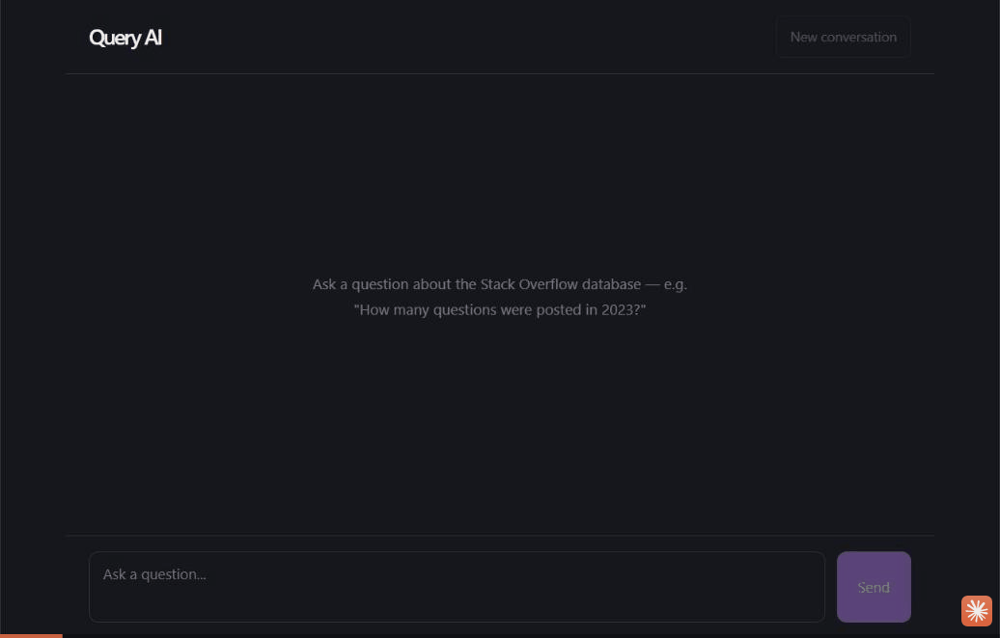
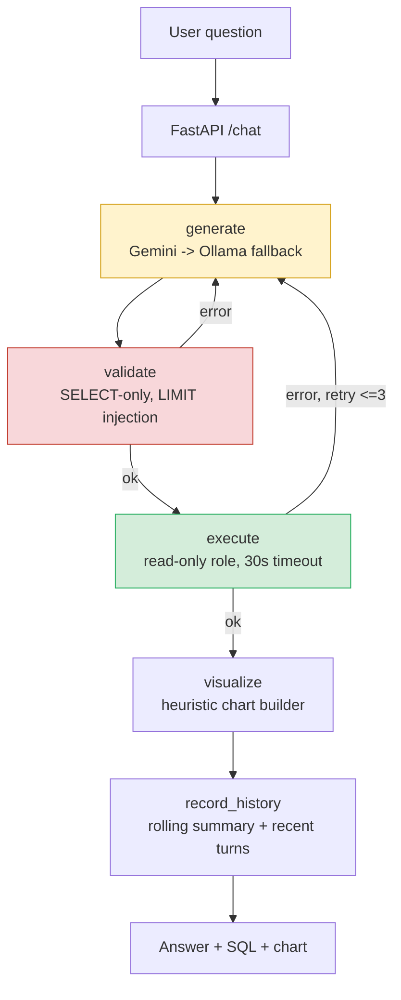

# Query AI

Ask a Stack Overflow-scale PostgreSQL database questions in plain English. Query AI turns the question into SQL with Gemini, validates it against a read-only safety layer, runs it, self-corrects on failure, remembers the conversation, and charts the result when it makes sense to.

It's built and tested against a real restore of the public [Stack Overflow data dump](https://archive.org/details/stackexchange) — 59.5M rows in `posts`, 236M in `votes`, ~117GB on disk — not a toy dataset. Every design decision in this repo (indexing, partitioning, retry logic, prompt engineering) exists because it broke at that scale first.



## What it actually does

- **Natural language → SQL** via Gemini (`gemini-3.5-flash`), with the real database schema (tables, columns, foreign keys, lookup-code meanings) injected into the prompt as DDL.
- **Self-correcting execution**: a [LangGraph](https://github.com/langchain-ai/langgraph) state machine (`agent.py`) generates → validates → executes, and on failure feeds the actual error back into the next generation attempt (up to 3 tries) instead of just failing.
- **Safety validation** (`sql_safety.py`): single-statement `SELECT`-only, rejects writes/DDL/stacked queries, injects a default `LIMIT 1000` when the generated query doesn't specify one.
- **Defense-in-depth database access**: a dedicated read-only Postgres role (`query_ai_agent`) with `default_transaction_read_only = on` and a 30s `statement_timeout`, so even a bug in the app layer can't write or hang the connection.
- **Conversational memory** with rolling summarization: recent turns are kept verbatim, older ones get folded into a running summary instead of growing the prompt unboundedly.
- **Automatic charting**: a deterministic heuristic (`visualization/chart_builder.py`) decides when a result is chart-worthy and renders it — no extra LLM call.
- **Local fallback**: if Gemini's API fails or the free-tier quota is exhausted, it falls back to a local [Ollama](https://ollama.com) model so the app keeps working instead of hard-failing.
- **Full observability**: structured JSON logs, Prometheus metrics per graph node and per request, a Grafana dashboard.
- **Built for actual scale, not assumed**: every index, the tag-search normalization table, and the `posts` partitioning in this repo exist because a specific real query timed out first — see [`PROJECT_PROGRESS.md`](PROJECT_PROGRESS.md) for the full bug-by-bug history.

## Architecture



| Layer | Tech |
|---|---|
| LLM | Gemini (`gemini-3.5-flash`) + local Ollama fallback |
| Orchestration | LangGraph (`StateGraph`, SQLite-backed checkpointer for memory) |
| Backend | FastAPI |
| Database | PostgreSQL 18 |
| Frontend | React + Vite |
| Charts | matplotlib (server-rendered, no client-side charting lib) |
| Observability | Prometheus + Grafana |
| Deployment | Docker Compose (app layer) |

## Before you start: about the data

This repo does **not** include the database dump — a full restore is ~117GB, too large for git and not something you'd want in a repo anyway.

**Source**: the official [Stack Exchange Data Dump](https://archive.org/details/stackexchange) on archive.org. It ships as per-site XML archives (`Posts`, `Users`, `Comments`, `Votes`, `Badges`, `Tags`, `PostHistory`, `PostLinks`), licensed cc-by-sa 4.0.

**Converting XML → PostgreSQL**: the dump itself is XML, not SQL — you need a conversion step. A few community tools built for exactly this:
- [`bersace/stackexchange-dump-to-postgres`](https://github.com/bersace/stackexchange-dump-to-postgres)
- [`pgtreats/stackoverflow_in_pg`](https://github.com/pgtreats/stackoverflow_in_pg)
- [`sth/sodata`](https://github.com/sth/sodata)

None of these is confirmed as exactly what was used to build the reference database for this repo — evaluate before trusting one blindly, same as any tool pulled off GitHub. What matters is the **resulting schema**, since `schema.py` reflects whatever tables actually exist in your database at runtime:

| Table | Notes |
|---|---|
| `posts` | Question + answer rows; `posttypeid` distinguishes them (see `lookups.py`) |
| `users` | |
| `comments` | |
| `votes` | `votetypeid` encodes up/down/accept/etc. (see `lookups.py`) |
| `badges` | |
| `postlinks` | `linktypeid` encodes linked vs. duplicate (see `lookups.py`) |
| `tags` | Has a precomputed `count` column — used for ranking questions like "top tags," see `sql_generator.py`'s `SYSTEM_PROMPT` |

`posthistory` is not required — this project's reference restore didn't include it, and nothing here depends on it. Extra or missing tables beyond the list above are handled gracefully (`schema.py` just reflects what's there), but performance work in this repo (`sql/add_indexes.sql`, `sql/normalize_tags.sql`, `sql/partition_posts.sql`) assumes something close to full scale. A smaller sample restore will still work — you'll just skip needing most of the performance tuning.

## Getting started

### 1. Prerequisites

- PostgreSQL 18+, with the dataset above restored into a database (this project's `.env` calls it `postgresql_query_ai`, but any name works)
- A [Gemini API key](https://ai.dev) (free tier is 20 requests/day/model — see the "About the free tier" note below)
- Either **Docker Desktop** (recommended path) or **Python 3.13+ and Node 22+** (manual path)
- Optional: [Ollama](https://ollama.com) installed locally with a model pulled (e.g. `ollama pull qwen3:0.6b`), for the fallback path to actually work when Gemini fails

### 2. Set up the database role and performance layer

Run these as a Postgres superuser, connected to your restored database:

```bash
psql -U postgres -d postgresql_query_ai -f sql/create_readonly_role.sql   # read-only app role — edit the password first
psql -U postgres -d postgresql_query_ai -f sql/add_indexes.sql            # date/tag-search indexes
psql -U postgres -d postgresql_query_ai -f sql/normalize_tags.sql         # fast tag-filtered queries
```

`sql/partition_posts.sql` and `sql/partition_votes.sql` are optional and meant to be run interactively, step by step (they say why inline) — only needed if you're working at the full ~59.5M-row scale and hitting timeouts on heavy analytical questions.

### 3. Configure environment

```bash
cp .env.example .env
# fill in DB_PASSWORD (the query_ai_agent role's password) and GEMINI_API_KEY
```

### 4a. Run with Docker (recommended)

Postgres itself stays outside Docker (it already has your data — no reason to duplicate 117GB into a volume). The app layer runs containerized and reaches your native Postgres via `host.docker.internal`, which needs one extra one-time step:

Add this line to your Postgres install's `pg_hba.conf` (find it via `SHOW hba_file;` in `psql`), then reload:

```
host    all             all             172.16.0.0/12           scram-sha-256
```

```bash
# reload without restarting Postgres:
psql -U postgres -c "SELECT pg_reload_conf();"

# bring up backend + frontend + Prometheus + Grafana:
docker compose up -d
```

Then open **http://localhost:5173**.

### 4b. Run manually (no Docker)

```bash
python -m venv venv
venv\Scripts\activate            # Windows
# source venv/bin/activate       # macOS/Linux
pip install -r requirements.txt

uvicorn backend.api:app --reload --host 127.0.0.1 --port 8000
```

In a second terminal:

```bash
cd frontend
npm install
npm run dev
```

Then open **http://localhost:5173**.

### 5. Verify it's working

```bash
curl http://localhost:8000/health
# {"status":"ok"}
```

Then ask it something in the UI: *"How many questions were posted in 2023?"*

### Observability (optional)

`docker compose up -d` already starts Prometheus (`localhost:9090`) and Grafana (`localhost:3000`, default login `admin`/`admin`) alongside the app. A starter dashboard with success/failure rates, latency percentiles, and per-node timing is provisioned automatically.

### About the free tier

Gemini's free tier caps at **20 requests/day/model**. Each question can cost up to 3 requests if the self-correction loop retries. If you're testing heavily, expect to hit `429 RESOURCE_EXHAUSTED` — this is exactly what the Ollama fallback is for, and also why `tests/test_agent.py`'s suite is meant to be run in small batches, not as one large sweep.

## Repo layout

```text
postgreSQL_query-ai/
├── agent.py                 # LangGraph state machine: the actual pipeline
├── sql_generator.py         # Gemini + Ollama fallback, prompt construction
├── sql_safety.py            # SELECT-only validation, LIMIT injection
├── schema.py                # Live schema reflection (SQLAlchemy inspect)
├── schema_prompt.py         # Renders reflected schema as DDL for the prompt
├── relationships.py         # Hand-encoded FKs (the dump has none enforced)
├── lookups.py                # posttypeid/votetypeid/linktypeid meanings
├── database.py               # SQLAlchemy engine, connection config
├── backend/api.py           # FastAPI: POST /chat, GET /health, /metrics
├── frontend/                # React + Vite chat UI
├── visualization/            # Deterministic chart-worthiness heuristics
├── observalibilty/           # Prometheus metrics + structured logging
├── sql/                      # DB setup: role, indexes, normalization, partitioning
├── docker/                   # Prometheus config for the Compose stack
├── tests/test_agent.py      # Difficulty-tiered latency/correctness harness
├── docker-compose.yml
├── Dockerfile.backend
└── PROJECT_PROGRESS.md      # Full development log, bug-by-bug
```

## Development history

This was built as a learning project with every bug, design decision, and dead end logged as it happened — see [`PROJECT_PROGRESS.md`](PROJECT_PROGRESS.md) for the full history and [`docs/DASHBOARD.md`](docs/DASHBOARD.md) for a visual summary. It's unusually detailed for a README link, but it's real: things like the `posts` partitioning migration, the silent-wrong-answer bug it surfaced, and how it got fixed are all in there.

## License

Apache 2.0 — see [`LICENSE`](LICENSE).
