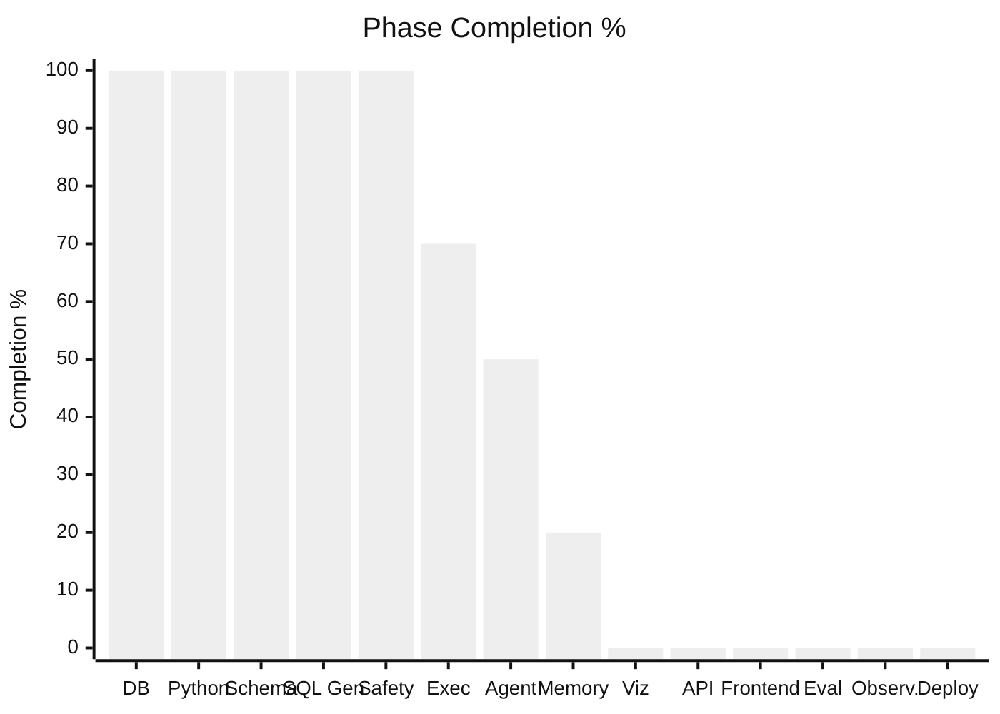
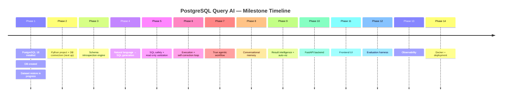
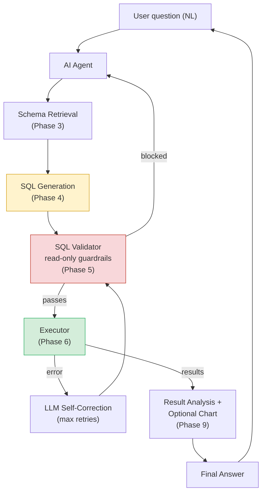
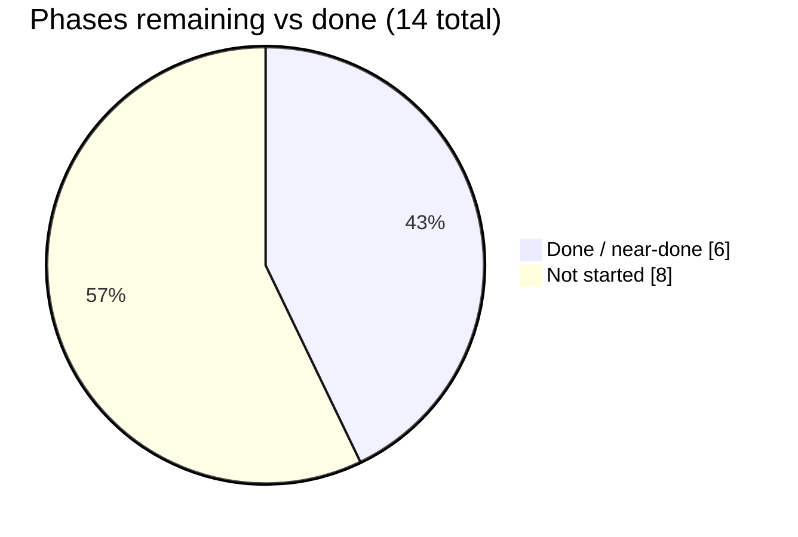

# 📊 PostgreSQL Query AI — Project Dashboard

> Auto-narrated from `project_metrics.json` and `PROJECT_PROGRESS.md`. Update both whenever this file is regenerated.

**Last updated:** 2026-08-17 · **Overall completion:** **46%** · **Current phase:** `8 — Conversational Memory`

---

## 🎯 Where we are right now

```
┌──────────────────────────────────────────────────────────┐
│  PHASE 8 · CONVERSATIONAL MEMORY → ~20%                     │
│  agent.py: history reducer field (accumulates across turns) │
│  + record_history_node (success-path only) + SqliteSaver    │
│  checkpointer keyed by thread_id (per-conversation isolation)│
│  generate_sql() now prompt-injects prior turns so follow-ups │
│  like "now show 2022 instead" can resolve "the same thing"  │
│  Scoped deliberately: no truncation/summarization yet for    │
│  long conversations — explicit next step, not forgotten      │
│  Both files hand-written from pseudocode, needed real fixes  │
│  (SyntaxErrors, a context-manager/module-scope API mismatch) │
│  before they'd run — now a recurring, expected step           │
└──────────────────────────────────────────────────────────┘
```

## 🧭 Overall Completion

```
[██████████████████░░░░░░░░░░░░░░░░░░░░░░]  46%
```

## 🪜 Phase-by-Phase Progress

| # | Phase | Status | Progress |
|---|-------|--------|----------|
| 1 | Database Foundation | 🟢 Complete | `██████████` 100% |
| 2 | Python Database Layer | 🟢 Complete | `██████████` 100% |
| 3 | Schema Intelligence | 🟢 Complete | `██████████` 100% |
| 4 | NL → SQL Generation | 🟢 Complete | `██████████` 100% |
| 5 | SQL Safety & Validation | 🟢 Complete | `██████████` 100% |
| 6 | Execution + Self-Correction | 🟡 In Progress | `███████░░░` 70% |
| 7 | Agentic Workflow (LangGraph) | 🟡 In Progress | `█████░░░░░` 50% |
| 8 | Conversational Memory | 🟡 In Progress | `██░░░░░░░░` 20% |
| 9 | Result Intelligence / Viz | ⬜ Not Started | `░░░░░░░░░░` 0% |
| 10 | FastAPI Backend | ⬜ Not Started | `░░░░░░░░░░` 0% |
| 11 | Frontend | ⬜ Not Started | `░░░░░░░░░░` 0% |
| 12 | Evaluation | ⬜ Not Started | `░░░░░░░░░░` 0% |
| 13 | Observability | ⬜ Not Started | `░░░░░░░░░░` 0% |
| 14 | Docker + Deployment | ⬜ Not Started | `░░░░░░░░░░` 0% |

## 📈 Phase Completion (visual)



## 🗺️ Milestone Timeline



## 🏗️ Architecture Overview (target end state)



## 🧪 Evaluation Metrics (populates from Phase 12 onward)

| Metric | Value |
|---|---|
| Questions tested | 2 |
| SQL execution success rate | 50% (1/2 — python-join question times out on all 3 retries) |
| Answer accuracy | 100% on completed queries (993,601 matches expected logic) |
| Average retries | 0 on the success, 3/3 (max) on the timeout case |
| Average latency | not yet measured |
| Token usage / query | not yet measured |

*Real evaluation rigor starts in Phase 12 — this is one manual smoke test, not a benchmark yet.*

## 🐛 Bugs Fixed (Phase 8 — conversational memory)

- `sql_generator.py`'s `generate_sql()` referenced a `history` parameter it never declared (`NameError`), and built `conversation_context` but never inserted it into the prompt. Both fixed.
- `agent.py`: a `:` used instead of `=` for a keyword argument, `state=AgentState` used instead of `state: AgentState`, a duplicate/stale `add_conditional_edges("execute", ...)` call (LangGraph doesn't support redefining a node's edges), and a stray extra `)` — all `SyntaxError`/compile-time failures, all fixed.
- `SqliteSaver.from_conn_string(...)` is a context-manager factory — only yields a usable saver inside `with`, which breaks a module-level `app` that other files import. Fixed by constructing `SqliteSaver` directly from a raw `sqlite3.connect(...)` connection instead.
- `tests/test_agent.py` called `app.invoke()` with no `thread_id` — confirmed this raises `ValueError` on a checkpointed graph. Fixed by giving each test case its own `thread_id`.
- Full detail in `PROJECT_PROGRESS.md`.

## 🐛 Bugs Fixed (Phase 7 — `agent.py`)

- File was named `langgraph.py`, which shadowed the real `langgraph` package on import — confirmed by the actual `ImportError` traceback pointing at itself. Renamed to `agent.py`.
- `langgraph` was never installed in the venv — installed (1.2.11), added to `requirements.txt`.
- Missing `pandas`/`DataFrame` imports despite using both — `NameError`s. Added.
- State schema/node mismatch: schema declared `validate_sql`, but the validate node wrote `validated_sql` and the execute node read `state["validate_sql"]` — guaranteed `KeyError` on any successful validation. Unified to `validated_sql`.
- `execute` node registered as `"Execute"` (capital E) but referenced as lowercase `"execute"` elsewhere — node-not-found at compile time. Also, conditional-edge maps used the string `'END'` instead of the real imported `END` sentinel, so those branches would never actually match. Both fixed.
- Full detail in `PROJECT_PROGRESS.md`'s Bugs Fixed section.

## 🐛 Bugs Fixed

- Connection string built via raw f-string broke on a password containing `@` (parsed as an extra host separator). Fixed with SQLAlchemy's `URL.create()`, which percent-encodes credentials.
- `schema.py` / `executor.py` used relative imports (`from .database import engine`) while being run as standalone scripts — `ImportError`. Fixed to absolute imports.
- `executor.py`'s retry loop had a bare `try:` with no matching `except`/`finally` — a `SyntaxError` that prevented the file from parsing at all. Restructured the try/except nesting and moved the final `raise` outside the loop.
- `executor.py` caught `sqlalchemy.exc.DBAPIError`, but `pd.read_sql()` re-wraps DB errors as `pandas.errors.DatabaseError` — the except clause never matched, so DB errors crashed instead of retrying. Fixed to catch the pandas exception type.
- `sql_safety.py`'s `validate_sql()` was typed `-> None` but returns a string — caused a type-checker false positive downstream. Fixed the annotation.
- First real query hit the read-only role's 30s `statement_timeout`: `posts` had no index on `creationdate`. Added `posts_posttypeid_creationdate_idx` via `CREATE INDEX CONCURRENTLY`.
- `pd.read_sql(validated_sql, conn)` raised `TypeError: immutabledict is not a sequence` on every query — passing a raw SQL string routes through SQLAlchemy's `exec_driver_sql`, which hands psycopg2 an empty `immutabledict` instead of `None`, and psycopg2 then tries to `%`-substitute against literal `%` in `LIKE` patterns. Fixed by wrapping the SQL in `sqlalchemy.text()`.
- A join question ("top 5 users ... about python") then hit the timeout again — `EXPLAIN` showed a full scan of ~18M question rows checking `tags LIKE '%<python>%'` row-by-row, since no existing btree index supports a leading-wildcard pattern. Added and applied a `pg_trgm` GIN index (`posts_tags_trgm_idx`). **Still times out** — the index is used correctly, but fetching the ~380K matching rows costs ~3.15M planner cost units because they're scattered across all 59.5M rows with no physical clustering by tag. Not a missing-index bug; a genuinely expensive query at this scale. Options being weighed: raise `statement_timeout` for heavy analytical queries, `CLUSTER posts` by tag (one-time, static dataset), or build a normalized tag lookup table.

## ✅ What's Done

- PostgreSQL 18 installed, `postgresql_query_ai` database created and restore verified
- Read-only role `query_ai_agent` created and tested (SELECT works, writes blocked, 30s statement timeout)
- Python project scaffold complete: venv, `requirements.txt`, `.env`, `database.py`
- Schema reflection (`schema.py`), hand-encoded FK relationships (`relationships.py`), and lookup-code documentation (`lookups.py`) merged into one structured schema
- `schema_prompt.py` renders that schema as `CREATE TABLE`-style DDL for the LLM prompt
- `sql_generator.py` (Gemini, `gemini-2.5-flash`) generates SQL from a natural-language question + schema context
- `sql_safety.py` validates single-statement SELECT-only, including a token scan that catches writable CTEs
- `executor.py` chains generation → validation → execution with a 3-attempt self-correction retry loop
- Added `posts_posttypeid_creationdate_idx` after discovering the missing index via a real timeout
- First full pipeline success: NL question → 993,601 (correct answer)
- GitHub repo scaffolded (README, LICENSE, `.gitignore`, remote configured)
- Progress tracking system established (`PROJECT_PROGRESS.md`, `project_metrics.json`, this dashboard)
- Phase 7 framework decided: LangGraph
- `agent.py`: first working `StateGraph` port of the retry loop, smoke-tested end-to-end
- `tests/test_agent.py`: difficulty-tiered sanity/latency harness, saves timestamped CSV results
- Conversational memory: `history` reducer, `record_history_node`, `SqliteSaver` checkpointer keyed by `thread_id`, history-aware `generate_sql()`
- GitHub Actions QC discussed, deliberately deferred to Phase 14 (CI can't reach the local 117GB DB)

## 🔜 What's Left (immediate)

- [ ] Run `agent.py`'s two-question smoke test once Gemini quota resets, to confirm follow-up questions actually resolve via history
- [ ] Re-run `tests/test_agent.py`'s full suite cleanly (last run hit the free-tier daily quota partway through)
- [ ] Decide: simple truncation vs. rolling summarization for long conversations — next memory design increment, deliberately not built yet
- [ ] Decide how to handle genuinely heavy analytical queries (raise `statement_timeout` for this class, `CLUSTER posts` by tag, or a normalized tag lookup table) — deferred, not blocking
- [ ] Consider enforcing a default `LIMIT` for un-bounded queries against huge tables
- [ ] Phase 10 (FastAPI backend) to expose the agent over HTTP, then Phase 11 (frontend chat widget) — needs Phase 10 first

## 🔭 What's Left (whole project, at a glance)



---

*Regenerate this file after each completed milestone — see `PROJECT_PROGRESS.md` for the authoritative log and `project_metrics.json` for machine-readable metrics.*
