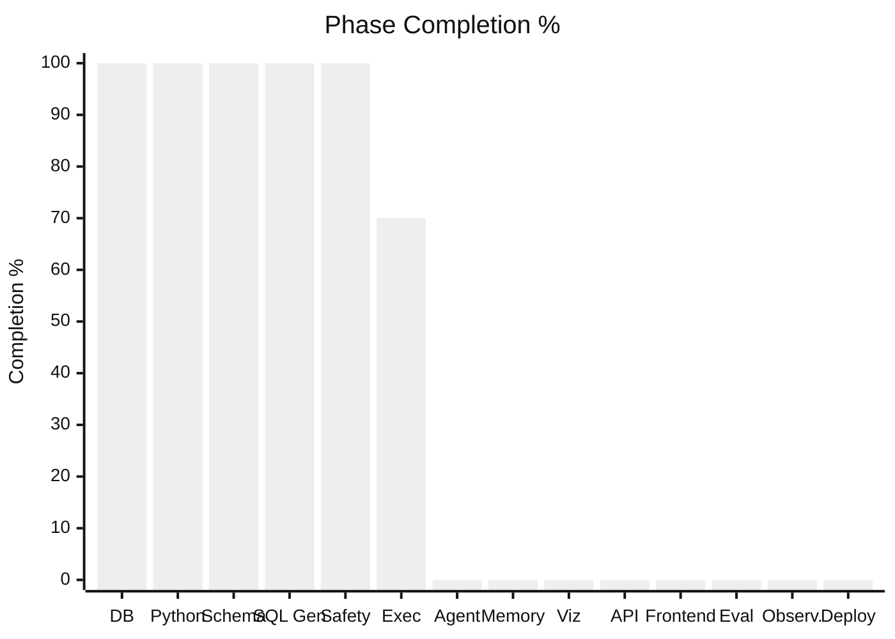
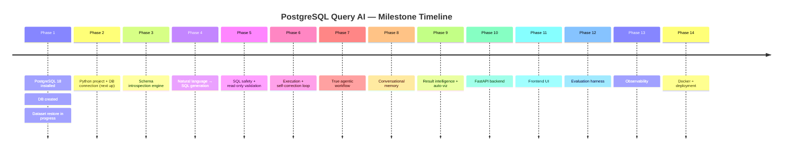
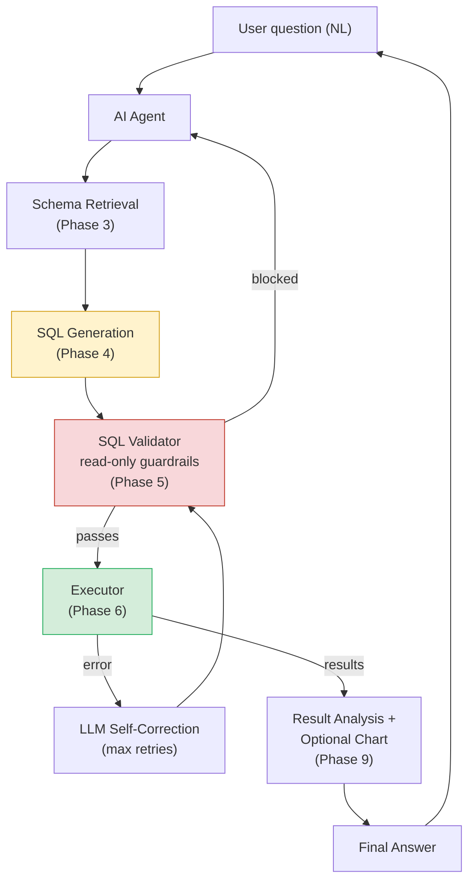
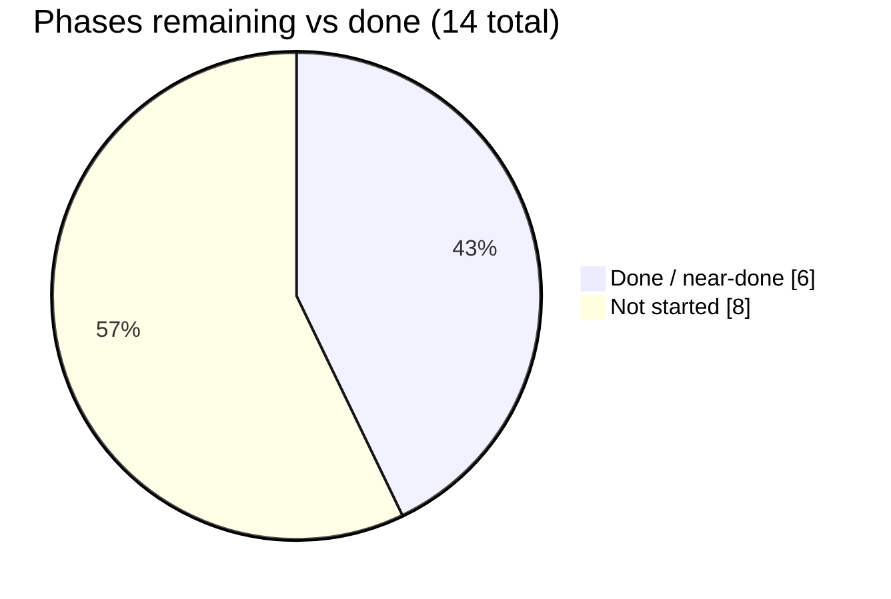

# 📊 PostgreSQL Query AI — Project Dashboard

> Auto-narrated from `project_metrics.json` and `PROJECT_PROGRESS.md`. Update both whenever this file is regenerated.

**Last updated:** 2026-08-16 · **Overall completion:** **41%** · **Current phase:** `6 — Execution + Self-Correction`

---

## 🎯 Where we are right now

```
┌──────────────────────────────────────────────────────────┐
│  PHASE 6 · EXECUTION + SELF-CORRECTION → ~70%              │
│  Full pipeline working: NL question → Gemini → sql_safety   │
│  → Postgres → DataFrame, with a 3-attempt self-correction   │
│  retry loop feeding errors back into generation             │
│  First real success: "questions posted in 2023?" → 993,601  │
│  Next: broaden test coverage, then Phase 7 (agent loop)     │
└──────────────────────────────────────────────────────────┘
```

## 🧭 Overall Completion

```
[████████████████░░░░░░░░░░░░░░░░░░░░░░]  41%
```

## 🪜 Phase-by-Phase Progress

| # | Phase | Status | Progress |
|---|-------|--------|----------|
| 1 | Database Foundation | 🟢 Complete | `██████████` 100% |
| 2 | Python Database Layer | 🟢 Complete | `██████████` 100% |
| 3 | Schema Intelligence | 🟢 Complete | `██████████` 100% |
| 4 | NL → SQL Generation | 🟢 Complete | `██████████` 100% |
| 5 | SQL Safety & Validation | 🟢 Complete | `██████████` 100% |
| 6 | Execution + Self-Correction | 🟡 In Progress | `███████░░░` 70% |
| 7 | Agentic Workflow | ⬜ Not Started | `░░░░░░░░░░` 0% |
| 8 | Conversational Memory | ⬜ Not Started | `░░░░░░░░░░` 0% |
| 9 | Result Intelligence / Viz | ⬜ Not Started | `░░░░░░░░░░` 0% |
| 10 | FastAPI Backend | ⬜ Not Started | `░░░░░░░░░░` 0% |
| 11 | Frontend | ⬜ Not Started | `░░░░░░░░░░` 0% |
| 12 | Evaluation | ⬜ Not Started | `░░░░░░░░░░` 0% |
| 13 | Observability | ⬜ Not Started | `░░░░░░░░░░` 0% |
| 14 | Docker + Deployment | ⬜ Not Started | `░░░░░░░░░░` 0% |

## 📈 Phase Completion (visual)



## 🗺️ Milestone Timeline



## 🏗️ Architecture Overview (target end state)



## 🧪 Evaluation Metrics (populates from Phase 12 onward)

| Metric | Value |
|---|---|
| Questions tested | 1 |
| SQL execution success rate | 100% (1/1, after the index fix) |
| Answer accuracy | 100% (1/1 — 993,601 matches expected logic) |
| Average retries | 0 (succeeded first attempt post-fix) |
| Average latency | not yet measured |
| Token usage / query | not yet measured |

*Real evaluation rigor starts in Phase 12 — this is one manual smoke test, not a benchmark yet.*

## 🐛 Bugs Fixed

- Connection string built via raw f-string broke on a password containing `@` (parsed as an extra host separator). Fixed with SQLAlchemy's `URL.create()`, which percent-encodes credentials.
- `schema.py` / `executor.py` used relative imports (`from .database import engine`) while being run as standalone scripts — `ImportError`. Fixed to absolute imports.
- `executor.py`'s retry loop had a bare `try:` with no matching `except`/`finally` — a `SyntaxError` that prevented the file from parsing at all. Restructured the try/except nesting and moved the final `raise` outside the loop.
- `executor.py` caught `sqlalchemy.exc.DBAPIError`, but `pd.read_sql()` re-wraps DB errors as `pandas.errors.DatabaseError` — the except clause never matched, so DB errors crashed instead of retrying. Fixed to catch the pandas exception type.
- `sql_safety.py`'s `validate_sql()` was typed `-> None` but returns a string — caused a type-checker false positive downstream. Fixed the annotation.
- First real query hit the read-only role's 30s `statement_timeout`: `posts` had no index on `creationdate`. Added `posts_posttypeid_creationdate_idx` via `CREATE INDEX CONCURRENTLY`.

## ✅ What's Done

- PostgreSQL 18 installed, `postgresql_query_ai` database created and restore verified
- Read-only role `query_ai_agent` created and tested (SELECT works, writes blocked, 30s statement timeout)
- Python project scaffold complete: venv, `requirements.txt`, `.env`, `database.py`
- Schema reflection (`schema.py`), hand-encoded FK relationships (`relationships.py`), and lookup-code documentation (`lookups.py`) merged into one structured schema
- `schema_prompt.py` renders that schema as `CREATE TABLE`-style DDL for the LLM prompt
- `sql_generator.py` (Gemini, `gemini-2.5-flash`) generates SQL from a natural-language question + schema context
- `sql_safety.py` validates single-statement SELECT-only, including a token scan that catches writable CTEs
- `executor.py` chains generation → validation → execution with a 3-attempt self-correction retry loop
- Added `posts_posttypeid_creationdate_idx` after discovering the missing index via a real timeout
- First full pipeline success: NL question → 993,601 (correct answer)
- GitHub repo scaffolded (README, LICENSE, `.gitignore`, remote configured)
- Progress tracking system established (`PROJECT_PROGRESS.md`, `project_metrics.json`, this dashboard)

## 🔜 What's Left (immediate)

- [ ] Test `run_question()` against harder questions (joins, lookup-code questions, ambiguous phrasing)
- [ ] Consider enforcing a default `LIMIT` for un-bounded queries against huge tables
- [ ] Start Phase 7: wrap the pipeline in something that can hold a conversation (follow-ups referring to prior results)

## 🔭 What's Left (whole project, at a glance)



---

*Regenerate this file after each completed milestone — see `PROJECT_PROGRESS.md` for the authoritative log and `project_metrics.json` for machine-readable metrics.*
