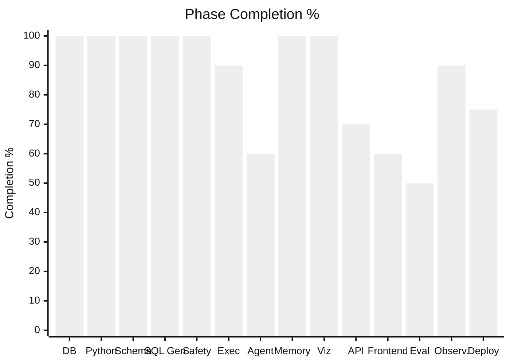
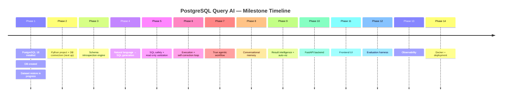
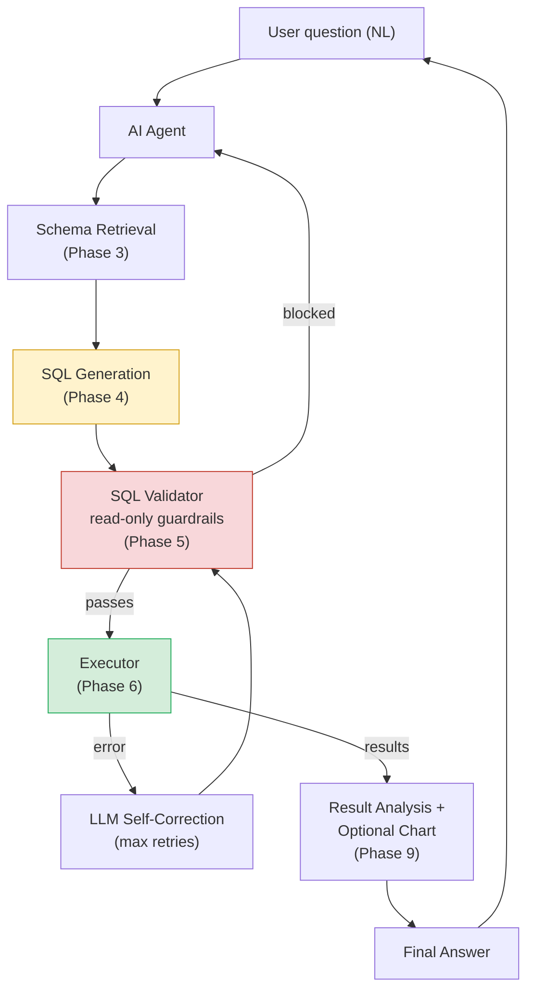
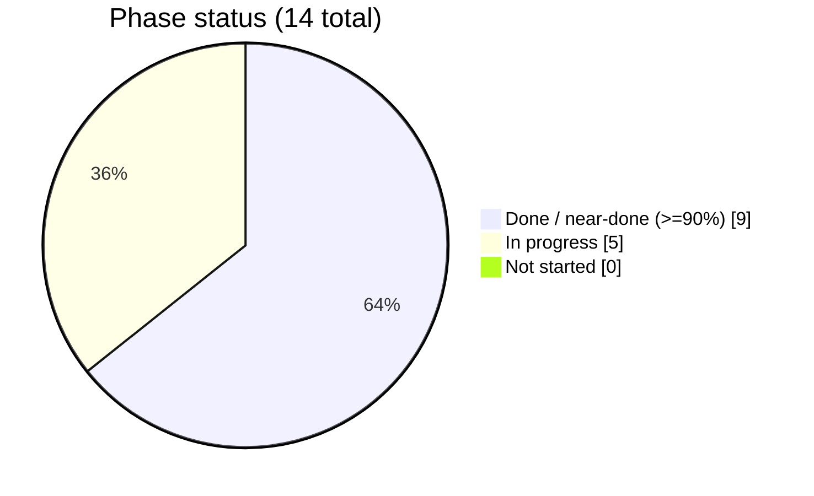

# 📊 PostgreSQL Query AI — Project Dashboard

> Auto-narrated from `project_metrics.json` and `PROJECT_PROGRESS.md`. Update both whenever this file is regenerated.

**Last updated:** 2026-08-20 · **Overall completion:** **85%** · **Current phase:** `Deployment done (Docker Compose) → posts partitioned → all today's goals complete`

---

## 🎯 Where we are right now

```
┌──────────────────────────────────────────────────────────┐
│  OBSERVABILITY LIVE + FIRST EVAL BASELINE IN — DEBUGGING       │
│  PASS STARTS NEXT                                              │
│  observalibilty/evaluation/{metrics,observability}.py wired    │
│  into all 4 agent.py nodes + backend/api.py's /chat. Docker    │
│  Compose runs Prometheus + Grafana; a 7-panel dashboard was    │
│  pushed via API, confirmed rendering real data.                │
│                                                                │
│  Full 9-question eval suite ran: 3/9 succeeded outright, but   │
│  4 of the 6 "failures" were Gemini's 20-req/day free-tier      │
│  quota running out mid-suite (429 RESOURCE_EXHAUSTED), not     │
│  real bugs — excluded from the numbers below. The 2 genuine    │
│  failures both trace to votes.creationdate having no index.    │
│  Also caught: sql_generator.py runs gemini-3.5-flash, not      │
│  gemini-2.5-flash as previously documented (confirmed          │
│  intentional; docs corrected).                                 │
│                                                                │
│  Decision: work around the quota by testing in small batches   │
│  going forward rather than upgrading billing.                  │
│                                                                │
│  Open Bugs #7/#8 FIXED — votes index built + verified live,    │
│  COUNT(*) prompt nudge added (Q1 succeeded in 1 attempt on     │
│  retest). #1/#2/#4 also FIXED — generate_node + /chat now      │
│  have catch-alls (verified live against a real 429), Gemini   │
│  output validation already existed, sql_safety.py now injects │
│  a default LIMIT 1000.                                         │
│                                                                │
│  #3 (conversational memory) CLOSED — quota reset by ~18:40     │
│  IST (consistent with the UTC-midnight theory). Ran the        │
│  two-question smoke test for real, then read the persisted     │
│  checkpoint state directly: the 2022 follow-up generated the   │
│  same COUNT(id) query shape as the 2023 original with the      │
│  year correctly re-derived from history — genuinely proven,    │
│  not just "didn't crash".                                      │
│                                                                │
│  PHASE 9 — VISUALIZATION built end-to-end and now VERIFIED    │
│  LIVE, in its own visualization/ package (mirrors              │
│  observalibilty/'s folder pattern). chart_builder.py picks     │
│  chart-worthy results via deterministic heuristics (no LLM     │
│  call) and renders a matplotlib PNG; wired into agent.py as    │
│  a new visualize node, backend/api.py's /chat response, and    │
│  a new ChartView.jsx on the frontend. Spot-checked through a   │
│  real Gemini-backed question ("top 5 tags by post count") —    │
│  correctly produced a bar chart with a real PNG. Phase done.   │
│                                                                │
│  #5 CLOSED — user wrote the rolling-summarization pseudocode    │
│  into sql_generator.py/agent.py; 3 real bugs found and fixed    │
│  (a NameError typo, generate_sql() missing the param it was     │
│  already being called with, a key typo silently breaking the   │
│  rolling-forward counter). Verified live: two chained           │
│  summarize_turn() calls produced a correct rolling summary.     │
│                                                                │
│  #6: user wanted RAG+sharding; real numbers ruled most of it    │
│  out — schema prompt is only ~740 tokens (RAG wouldn't help,    │
│  would cost quota), and full-table partitioning needs ~68-86GB  │
│  headroom against only 83GB free (too risky, deferred to        │
│  Phase 14, and wouldn't have fixed the actual failing query      │
│  anyway — no date filter). Instead: built sql/normalize_tags.sql │
│  (post_tags table — fixes the actual open tag-scan timeout,     │
│  safe at ~7-8GB) — written but NOT YET RUN by the user.          │
│                                                                │
│  #6 CLOSED — user ran normalize_tags.sql (post_tags: 71.3M      │
│  rows, both indexes built, query_ai_agent confirmed SELECT      │
│  works with no manual grant). Retested the actual originally-   │
│  failing question live: attempt 1 used post_tags correctly but  │
│  as JOIN+DISTINCT and still timed out; attempt 2 regenerated    │
│  as an EXISTS subquery and finished in 1.6s, correct answer.    │
│  Recovers within budget now — before this fix it failed all 3   │
│  attempts every time. Closed per the project's existing         │
│  standard (recovery-within-budget = pass).                      │
│                                                                │
│  ALL 8 ORIGINALLY-DOCUMENTED OPEN BUGS (#1-#8) ARE NOW FIXED.   │
│                                                                │
│  NEW (user request, not from the bug list): local Ollama       │
│  fallback added. generate_sql() now falls back to a local       │
│  qwen3:0.6b model when Gemini's API/quota fails, so the        │
│  pipeline keeps working during an outage instead of failing     │
│  outright. One bug found+fixed (OLLAMA_MODEL typo'd without     │
│  the "3", would've silently 404'd). Verified in stages (Ollama  │
│  call, Gemini-failure routing via monkeypatch, safety           │
│  validation of the resulting SQL) — not yet seen through a       │
│  real quota exhaustion in the live graph.                       │
│                                                                │
│  Disk space improved to a stable 122GB free — posts partition-  │
│  ing (68GB) is now reasonably safe too, not just votes (18GB).  │
│  Runbooks written: sql/partition_votes.sql, sql/partition_      │
│  posts.sql — not yet run (needs superuser, interactive).        │
│                                                                │
│  Backend+frontend verified LIVE in a real browser. Found+fixed  │
│  one real regression: the post_tags prompt nudge was too        │
│  broad, causing "top 5 tags" to wrongly aggregate over 71M      │
│  post_tags rows (28.7s) instead of using tags.count (195ms).    │
│  Fixed by scoping the rule to filtering vs. ranking. Re-        │
│  verified live — 195.1ms after the fix. IPv4 fix confirmed      │
│  working in the real UI.                                        │
│                                                                │
│  POSTS PARTITIONED (2026-08-20): user ran the full runbook,     │
│  posts is now a partitioned table, posts_old dropped, all 9     │
│  indexes propagated correctly. Surfaced a real silent-wrong-    │
│  answer bug: Gemini sometimes queried posts_yXXXX child         │
│  partitions directly instead of the parent+filter, causing a    │
│  genuinely wrong count:0 while the migration was mid-flight.    │
│  Fixed with a SYSTEM_PROMPT rule forcing the safe parent-table  │
│  path; verified live post-fix. votes was NOT partitioned        │
│  (runbook available, unused).                                   │
│                                                                │
│  DEPLOYMENT DONE — Docker Compose, run locally (117GB dataset   │
│  ruled out a live cloud host, same reasoning as the deferred    │
│  CI). Postgres stays native; backend+frontend containerized     │
│  alongside prometheus/grafana. Found+fixed 2 cross-environment  │
│  bugs (Ollama fallback + DB_HOST both hardcoded "localhost",    │
│  which means the container itself inside Docker) before they    │
│  could bite. Needed a pg_hba.conf change for the container to   │
│  reach native Postgres — Claude edited it, user reloaded it     │
│  (no OS signal permission from Claude's shell). All 4            │
│  containers verified live, including a real browser test        │
│  through the containerized frontend end to end.                 │
│                                                                │
│  ALL THREE OF TODAY'S GOALS DONE: partitioning, backend/         │
│  frontend verification, deployment.                             │
└──────────────────────────────────────────────────────────┘
```

## 🧭 Overall Completion

```
[███████████████████████████████████░░░]  85%
```

## 🪜 Phase-by-Phase Progress

| # | Phase | Status | Progress |
|---|-------|--------|----------|
| 1 | Database Foundation | 🟢 Complete | `██████████` 100% |
| 2 | Python Database Layer | 🟢 Complete | `██████████` 100% |
| 3 | Schema Intelligence | 🟢 Complete | `██████████` 100% |
| 4 | NL → SQL Generation | 🟢 Complete | `██████████` 100% |
| 5 | SQL Safety & Validation | 🟢 Complete | `██████████` 100% |
| 6 | Execution + Self-Correction | 🟢 Near-Complete | `█████████░` 90% |
| 7 | Agentic Workflow (LangGraph) | 🟡 In Progress | `██████░░░░` 60% |
| 8 | Conversational Memory | 🟢 Complete | `██████████` 100% |
| 9 | Result Intelligence / Viz | 🟢 Complete | `██████████` 100% |
| 10 | FastAPI Backend | 🟢 Near-Complete | `███████░░░` 70% |
| 11 | Frontend | 🟡 In Progress | `██████░░░░` 60% |
| 12 | Evaluation | 🟡 In Progress | `█████░░░░░` 50% |
| 13 | Observability | 🟢 Near-Complete | `█████████░` 90% |
| 14 | Docker + Deployment | 🟢 Near-Complete | `███████░░░` 75% |

## 📈 Phase Completion (visual)



## 🗺️ Milestone Timeline



## 🏗️ Architecture Overview (target end state)



## 🧪 Evaluation Metrics (first full suite run, 2026-08-18)

| Metric | Value |
|---|---|
| Questions tested (clean signal) | 5 of 9 — the other 4 hit a Gemini free-tier quota limit mid-run, excluded |
| SQL execution success rate | 60% (3/5) |
| Answer accuracy | 100% on completed queries |
| Average retries | 1.7 across successes (2, 2, 1 attempts); both failures hit max (3/3) |
| Average latency | 65.9s across the 5 clean results — dominated by 30s-per-timed-out-attempt cost |
| Token usage / query | not yet measured |

Successes: "questions posted in 2023" (2 attempts, 105.8s — attempt 1's `COUNT(*)` timed out, attempt 2's `COUNT(id)` succeeded), "posts marked as duplicates" (2 attempts, 53.2s), "who are the best users" (1 attempt, 3.3s). Genuine failures: "upvotes cast in 2022" and "rep>1000, never deletion-voted" — both hit 3/3 attempts, both root-caused to `votes.creationdate` having no index.

**Excluded (not real failures):** the hard/stress-tier questions (5, 6, 8, 9) returned `429 RESOURCE_EXHAUSTED` — Gemini's free tier caps at 20 requests/day/project/model, and this run's up-to-27 generate calls burned through it mid-suite. Re-test these once quota resets, in small batches.

*Full results: `eval_results_20260818_190634.csv`. Next: re-run the hard/stress tier once the two confirmed bugs (`votes` index, `COUNT(*)` prompt bias) are fixed, to get a real baseline unaffected by known issues.*

## 🐛 Bugs Fixed (post-partitioning — closed 2026-08-20, silent wrong answer)

- Not one of the original 8 Open Bugs — surfaced live during Docker deployment testing right after `posts` was partitioned. Gemini would sometimes query a `posts_yXXXX` child partition directly instead of the parent `posts` + `creationdate` filter — genuinely produced a wrong `count: 0` while the migration was mid-flight (empty child, real data still in the old table). Confirmed the risk wasn't just a migration-timing fluke: a cross-year test question showed multi-year queries already safely used the parent+filter form, but single-year queries could still resolve to a direct child-table hit. Fixed with a `SYSTEM_PROMPT` rule forcing the safe path; rebuilt the Docker image and verified live. Second silent-wrong-answer bug in this project (vs. the louder DataFrame/msgpack crash) — a reminder that timeouts and crashes aren't the only failure mode worth watching for.

## 🐛 Bugs Fixed (Open Bug #3 — closed 2026-08-19, quota reset)

- Conversational memory had never been proven working end-to-end — earlier attempts kept hitting `429 RESOURCE_EXHAUSTED` before the follow-up question resolved. Quota reset by ~18:40 IST; ran the two-question smoke test for real and read the persisted checkpoint state directly (`app.get_state()`) rather than trusting printed output. The 2022 follow-up generated the same `COUNT(id)` query shape as the 2023 original, with the year correctly re-derived from injected history — genuinely proven, not a code fix (the code was already correct).

## 🐛 Bugs Fixed (Open Bugs #1/#2/#4 — post-observability debugging pass, continued)

- `generate_node` only caught `google.genai.errors.APIError`; `backend/api.py`'s `/chat` had no catch-all beyond the `RuntimeError`→422 path. Fixed: a trailing `except Exception` in `generate_node` routes any other failure back through the normal retry logic instead of crashing; `/chat` wraps `agent_app.invoke()` in `try/except Exception` → clean 500. Verified live — a real `429` during the #3 memory test was caught and retried cleanly, no crash.
- `sql_generator.generate_sql()` didn't validate Gemini's output before returning it — already fixed: raises `SQLGenerationError` on a `None` or empty-after-cleanup response.
- No default `LIMIT` enforcement in `sql_safety.py` — an unbounded question against `posts`/`votes` could pull an enormous result set into memory. Fixed: `validate_sql()` injects `LIMIT 1000` when no top-level `LIMIT` is present; no-ops on aggregate queries and queries with their own `LIMIT`. Verified via the file's own sanity checks.

## 🐛 Bugs Fixed (Open Bugs #7/#8 — post-observability debugging pass)

- `votes` (~236M rows) had no index covering `creationdate` — a `votetypeid`+`creationdate`-filtered `COUNT` timed out on all 3 self-correction attempts. Fixed with `votes_votetypeid_creationdate_idx` (`sql/add_indexes.sql`), run by the user as superuser and verified live (`indisvalid = t`, `ANALYZE votes` ran).
- Gemini generated `COUNT(*)` more often than `COUNT(id)`/`COUNT(1)` on `posts`/`votes`, slow enough to hit the 30s `statement_timeout` on attempt 1 even though the retry usually recovered on attempt 2. Fixed by adding a rule to `sql_generator.py`'s `SYSTEM_PROMPT` telling Gemini to prefer `COUNT(id)`/`COUNT(1)`. Not yet retested against a live question.

## 🐛 Bugs Fixed (session handoff — real browser testing)

- User tested in a real (non-automated) browser tab and hit "Failed to fetch" despite curl working against the same `/chat` endpoint. Root cause: `localhost` resolves to IPv6 (`::1`) on this machine (confirmed via `ping`), uvicorn only binds IPv4 (`127.0.0.1`, confirmed via its own log) — the frontend's `fetch()` was silently trying the wrong address. Fixed by hardcoding `frontend/src/api.js`'s `API_BASE` to `http://127.0.0.1:8000`. **Not yet committed** — first thing to do next session.

## 🐛 Bugs Fixed (Phase 10/11 — backend + frontend verification)

- `AgentState.result` was a raw `pandas.DataFrame`. `SqliteSaver` persists the *whole* state via msgpack after every node — `DataFrame` has no msgpack representation, so **every successful query crashed** (`TypeError: Type is not msgpack serializable: DataFrame`), not an edge case. Existed since memory was added, only surfaced now under a real end-to-end test. Fixed: `result` is now `{"columns": [...], "rows": [...]}` everywhere (`agent.py`, `backend/api.py`, `tests/test_agent.py`); `run_question()` reconstructs a `DataFrame` before returning to preserve its documented type for CLI/test callers.
- `generate_node` had no error handling for the Gemini call itself — a transient `APIError` (429 and 503 both genuinely hit today) crashed straight out of the graph. Fixed by catching `google.genai.errors.APIError` and adding a new `after_generate` router so generation failures retry through the same loop as validation/execution failures, instead of the fixed `generate → validate` edge assuming generation always succeeds.
- `backend/api.py`'s `ChatResponse.columns` was typed `list[dict]` instead of `list[str]` — would fail Pydantic response validation on every call. Fixed.
- Full detail in `PROJECT_PROGRESS.md`.

## 🐛 Bugs Fixed (Phase 8 — conversational memory)

- `sql_generator.py`'s `generate_sql()` referenced a `history` parameter it never declared (`NameError`), and built `conversation_context` but never inserted it into the prompt. Both fixed.
- `agent.py`: a `:` used instead of `=` for a keyword argument, `state=AgentState` used instead of `state: AgentState`, a duplicate/stale `add_conditional_edges("execute", ...)` call (LangGraph doesn't support redefining a node's edges), and a stray extra `)` — all `SyntaxError`/compile-time failures, all fixed.
- `SqliteSaver.from_conn_string(...)` is a context-manager factory — only yields a usable saver inside `with`, which breaks a module-level `app` that other files import. Fixed by constructing `SqliteSaver` directly from a raw `sqlite3.connect(...)` connection instead.
- `tests/test_agent.py` called `app.invoke()` with no `thread_id` — confirmed this raises `ValueError` on a checkpointed graph. Fixed by giving each test case its own `thread_id`.
- Full detail in `PROJECT_PROGRESS.md`.

## 🐛 Bugs Fixed (Phase 7 — `agent.py`)

- File was named `langgraph.py`, which shadowed the real `langgraph` package on import — confirmed by the actual `ImportError` traceback pointing at itself. Renamed to `agent.py`.
- `langgraph` was never installed in the venv — installed (1.2.11), added to `requirements.txt`.
- Missing `pandas`/`DataFrame` imports despite using both — `NameError`s. Added.
- State schema/node mismatch: schema declared `validate_sql`, but the validate node wrote `validated_sql` and the execute node read `state["validate_sql"]` — guaranteed `KeyError` on any successful validation. Unified to `validated_sql`.
- `execute` node registered as `"Execute"` (capital E) but referenced as lowercase `"execute"` elsewhere — node-not-found at compile time. Also, conditional-edge maps used the string `'END'` instead of the real imported `END` sentinel, so those branches would never actually match. Both fixed.
- Full detail in `PROJECT_PROGRESS.md`'s Bugs Fixed section.

## 🐛 Bugs Fixed

- Connection string built via raw f-string broke on a password containing `@` (parsed as an extra host separator). Fixed with SQLAlchemy's `URL.create()`, which percent-encodes credentials.
- `schema.py` / `executor.py` used relative imports (`from .database import engine`) while being run as standalone scripts — `ImportError`. Fixed to absolute imports.
- `executor.py`'s retry loop had a bare `try:` with no matching `except`/`finally` — a `SyntaxError` that prevented the file from parsing at all. Restructured the try/except nesting and moved the final `raise` outside the loop.
- `executor.py` caught `sqlalchemy.exc.DBAPIError`, but `pd.read_sql()` re-wraps DB errors as `pandas.errors.DatabaseError` — the except clause never matched, so DB errors crashed instead of retrying. Fixed to catch the pandas exception type.
- `sql_safety.py`'s `validate_sql()` was typed `-> None` but returns a string — caused a type-checker false positive downstream. Fixed the annotation.
- First real query hit the read-only role's 30s `statement_timeout`: `posts` had no index on `creationdate`. Added `posts_posttypeid_creationdate_idx` via `CREATE INDEX CONCURRENTLY`.
- `pd.read_sql(validated_sql, conn)` raised `TypeError: immutabledict is not a sequence` on every query — passing a raw SQL string routes through SQLAlchemy's `exec_driver_sql`, which hands psycopg2 an empty `immutabledict` instead of `None`, and psycopg2 then tries to `%`-substitute against literal `%` in `LIKE` patterns. Fixed by wrapping the SQL in `sqlalchemy.text()`.
- A join question ("top 5 users ... about python") then hit the timeout again — `EXPLAIN` showed a full scan of ~18M question rows checking `tags LIKE '%<python>%'` row-by-row, since no existing btree index supports a leading-wildcard pattern. Added and applied a `pg_trgm` GIN index (`posts_tags_trgm_idx`). **Still times out** — the index is used correctly, but fetching the ~380K matching rows costs ~3.15M planner cost units because they're scattered across all 59.5M rows with no physical clustering by tag. Not a missing-index bug; a genuinely expensive query at this scale. Options being weighed: raise `statement_timeout` for heavy analytical queries, `CLUSTER posts` by tag (one-time, static dataset), or build a normalized tag lookup table.

## ✅ What's Done

- PostgreSQL 18 installed, `postgresql_query_ai` database created and restore verified
- Read-only role `query_ai_agent` created and tested (SELECT works, writes blocked, 30s statement timeout)
- Python project scaffold complete: venv, `requirements.txt`, `.env`, `database.py`
- Schema reflection (`schema.py`), hand-encoded FK relationships (`relationships.py`), and lookup-code documentation (`lookups.py`) merged into one structured schema
- `schema_prompt.py` renders that schema as `CREATE TABLE`-style DDL for the LLM prompt
- `sql_generator.py` (Gemini, `gemini-3.5-flash`) generates SQL from a natural-language question + schema context
- `sql_safety.py` validates single-statement SELECT-only, including a token scan that catches writable CTEs
- `executor.py` chains generation → validation → execution with a 3-attempt self-correction retry loop
- Added `posts_posttypeid_creationdate_idx` after discovering the missing index via a real timeout
- First full pipeline success: NL question → 993,601 (correct answer)
- GitHub repo scaffolded (README, LICENSE, `.gitignore`, remote configured)
- Progress tracking system established (`PROJECT_PROGRESS.md`, `project_metrics.json`, this dashboard)
- Phase 7 framework decided: LangGraph
- `agent.py`: first working `StateGraph` port of the retry loop, smoke-tested end-to-end
- `tests/test_agent.py`: difficulty-tiered sanity/latency harness, saves timestamped CSV results
- Conversational memory: `history` reducer, `record_history_node`, `SqliteSaver` checkpointer keyed by `thread_id`, history-aware `generate_sql()`
- GitHub Actions QC discussed, deliberately deferred to Phase 14 (CI can't reach the local 117GB DB)
- `backend/api.py`: FastAPI `/chat` + `/health`, CORS configured for the Vite dev origin, verified working end-to-end via curl (correct answer, HTTP 200)
- `frontend/`: React + Vite chat widget, built by Claude per the user's request (not pseudocode-first, unlike the Python files) — UI verified rendering and accepting input via screenshots
- Three real bugs found and fixed during end-to-end verification: the `DataFrame`/msgpack checkpointer crash (affected every successful query since memory was added), missing error handling in `generate_node` for Gemini API failures, and an IPv4/IPv6 `localhost` mismatch breaking the browser's `fetch()`
- MVP declared functionally ready by the user — session ends here, next session pivots to Observability + Evaluation before further bug fixing
- **Observability implemented and verified live**: `observalibilty/evaluation/metrics.py` (Prometheus `Counter`/`Histogram`s) + `observalibilty/evaluation/observability.py` (`log_node` decorator wrapping all 4 `agent.py` nodes, `log_chat_request` for `/chat` — each writes a structured JSON line to `logs/agent.log` *and* updates Prometheus in one call); `/metrics` mounted in `backend/api.py`; `docker-compose.yml` runs Prometheus + Grafana; a 7-panel Grafana dashboard pushed via API, confirmed rendering real scraped data via a live browser check
- Two real findings surfaced immediately from the new instrumentation: `votes` has no `creationdate` index (unrecovered 3/3-attempt timeout), and Gemini prefers `COUNT(*)` over `COUNT(id)` on huge tables (recoverable on retry, but wastes a 30s+ attempt) — both logged as new Open Bugs items
- Open Bugs #1, #2, #3, #4, #7, #8 all fixed and verified (see Bugs Fixed sections above)
- **Phase 9 — Visualization built end-to-end and verified live**: `visualization/chart_builder.py` (new package, mirrors `observalibilty/`'s folder pattern) picks chart-worthy results via deterministic heuristics and renders a `matplotlib` PNG — no LLM call. Wired into `agent.py` as a new `visualize` node, `backend/api.py`'s `/chat` response, and a new `frontend/ChartView.jsx`. Verified standalone, in a live browser check with seeded data, and through a real Gemini-backed question ("top 5 tags by post count" → correct bar chart with a real PNG)

## 🔜 What's Left (immediate)

- [x] **Observability**: structured logging per graph node + per `/chat` request, Prometheus + Grafana with a live dashboard — done and verified
- [x] **Evaluation (first pass)**: full 9-question suite run — 5/9 clean signal, 4/9 invalidated by Gemini's daily quota. Re-run the invalidated tier once quota resets and the two confirmed bugs below are fixed
- [ ] Commit `frontend/src/api.js`'s IPv4/IPv6 fix, and get the user's confirmation that a real browser question now round-trips successfully (still pending, not currently blocking)
- [x] **Open Bugs #7/#8**: `votes.creationdate` index and Gemini's `COUNT(*)` preference — both fixed and verified
- [x] **Open Bugs #1/#2/#4**: `generate_node`/`/chat` error-handling gap, Gemini output validation, default `LIMIT` enforcement — all fixed and verified
- [x] **Open Bug #3**: prove conversational memory follow-ups actually resolve correctly — closed, verified via persisted checkpoint state showing correct history-aware SQL regeneration
- [x] **Phase 9 — Visualization**: `visualization/chart_builder.py` + `agent.py`'s `visualize` node + `/chat` response fields + `frontend/ChartView.jsx` — built and verified standalone, in-browser, and through a real Gemini-backed question
- [x] **Open Bugs #5/#6**: rolling summarization built; `post_tags` normalization + `SYSTEM_PROMPT` scoping fixed the tag-scan timeout — both closed
- [x] **`posts` partitioning**: done, verified, one real bug (silent wrong answer) found and fixed along the way
- [x] **Deployment (Phase 14)**: Docker Compose brings up the full stack locally (Postgres stays native); verified live end-to-end including a real browser test
- [ ] `votes` partitioning — runbook available, not run (not currently needed)
- [ ] No README/deployment doc yet explaining `docker compose up -d` or the `pg_hba.conf` requirement
- [ ] Ollama fallback not yet tested against a real forced Gemini failure (only simulated so far, in and out of Docker)

## 🔭 What's Left (whole project, at a glance)



---

*Regenerate this file after each completed milestone — see `PROJECT_PROGRESS.md` for the authoritative log and `project_metrics.json` for machine-readable metrics.*
